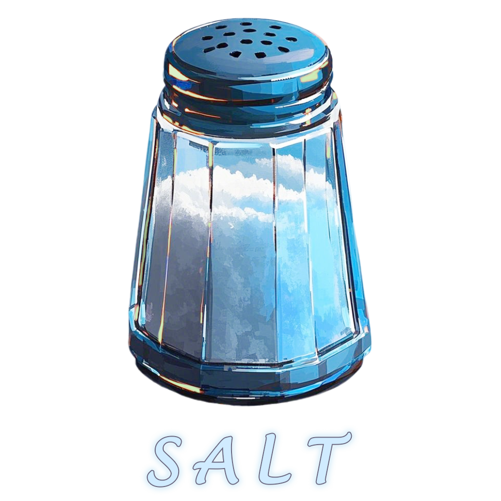

# SALT: A Flexible Semi-Automatic Labeling Tool for General LiDAR Point Clouds with Adaptive Cross-Scene and 4D Consistency

This repo is the official project repository of SALT.

## 1. Overview
We introduce SALT, a flexible semi-automatic labeling tool for general LiDAR point clouds, featuring adaptive cross-scene and 4D consistency. 
SALT demonstrates exceptional zero-shot adaptability across various sensors, scenes, and motion conditions, greatly enhancing annotation efficiency.

## 2. Environment

## 3. User Manual 
### 3.1 Automatic Segmentation of Whole sequence
After loading the raw point cloud sequence data, the user
 only needs to click the "SALT" button once to obtain the pre-segmentation results 
 for the entire sequence. After clicking the "SALT" button, users can modify the config file according to their own data characteristics. 
 Once the progress bar (zero-shot segmentation step) is complete, the pre-segmentation
  results are automatically saved for subsequent semantic and instance labeling. The pre-segmentation results are also 
  automatically displayed in the user interface with different colors.

  
### 3.2 Manual Assignment and Refinement for Semantic Annotation
The user is free to define as many semantic classes appear in the
sequence. Users can assign custom semantic labels to the pre-segmentation results based 
on their needs. By simply clicking on a predefined color button
 representing a specific semantic category and then selecting a point cloud with a particular ID, all 
 points with that ID will be assigned the chosen label and updated to the corresponding color. This 
 operation is as intuitive and effortless as a coloring game. Please note that the colors used to display 
 the pre-segmentation results are designed to avoid overlapping with user-defined semantic label colors. 
 If users are not satisfied with the pre-annotated results, they can modify them using the polygon tool. 
 Inherited from LABELER, SALT supports the option to hide other classes, making manual annotation adjustments 
 more convenient.

 
### 3.3 Auto Ordering and Manual Refinement for Instance Annotation
Once users are satisfied with the semantic labeling results, they can simply click the "Auto Instance" button
 to automatically assign instance IDs to all semantic categories. Users
  can then further refine the results by splitting or merging instance IDs within each category.

## 4. Quick Demo

## 5. Acknowledgements
We would like to thank all the pioneers [SemanticKITTI_LABLER](https://github.com/jbehley/point_labeler), [SAM2](https://github.com/facebookresearch/sam2). 

## 6. Citation
If your like our projects, please cite us and give this repo a star.
